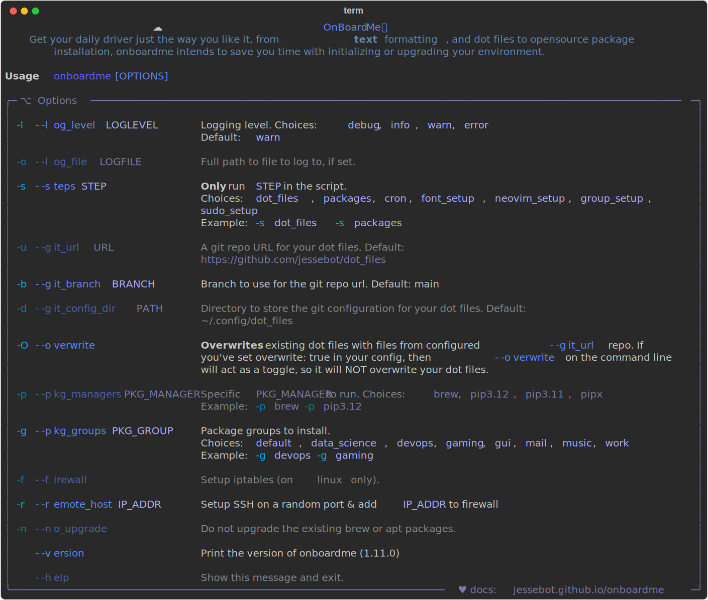

<h1 align="center">
  
  💻 onboard<i>me</i>
  
</h1>

<a href="https://github.com/jessebot/onboardme/releases"></a> [](https://cloud.docker.com/u/jessebot/repository/docker/jessebot/onboardme)

Get your daily driver, or personalized 🐳 container, just the way you like it! From dot files management, to package installation, to setting up neovim, to other little features you didn't know you needed, `onboardme` intends to save you time with initializing and maintaining your personal evironments ✨

<p align="center">

</p>

## Features

<details>
  <summary><h4>Keep your Dot Files Up To Date Across multiple systems</h4></summary>

`onboardme` can manage your [dot files] using a git by turning your home directory into a repo.
We even provide default dot files, so you don't have to manage them
- The [default dot files] are open source, and the maintainers use these themselves
- They cover a lot of common apps/tools you probably want anyway
- They have consistent colorschemes accross different CLI/TUI programs 😃
- They set all the helpful BASH aliases you could need (zsh support coming soon)

</details>

<details>
  <summary><h4>Package management accross multiple package managers<h4></summary>

We install and upgrade libraries and apps using common package managers. We also provide a currated list of default packages.

- checkout the [default packages]
- supports `brew`, `apt`, `snap`, `flatpak`, and `pip` (and you can add your own 😄)
- group together packages for different kinds of environments
  - onboardme provides default package groups:
    - default (no desktop GUI apps installed by default, always installed)
    - macOS (default apps for _macOS only_ apps, always installed on macOS)
    - gui (default GUI apps for Linux desktops, optionally installed)
    - devops (devops related tooling, optionally installed)

<sub>**Linux ARM Users NOTE**: `brew` is currently [unsupported on linux/arm64](https://docs.brew.sh/Homebrew-on-Linux#arm-unsupported), and as we'd have to compile everything from source anyway, we don't support running the brew package manager via onboardme on linux/arm64 or (AArch64) at all right now._
We do have a docker image ([jessebot/onboardme:latest-arm](https://hub.docker.com/r/jessebot/onboardme)) optimized for arm though that you can run on AArch64 and it's perfect for a dockerized dev environment on an M1 or later mac or any other ARM 64 device that runs docker :)</sub>

</details>

<details>
  <summary><h4>NeoVim Plugin Installtion and Updates<h4></summary>


`onboardme` keeps your neovim plugins installed and up to date with [lazy.nvim] under the hood.

<h4>Why no vim though?</h4>

If you haven't already made the switch from Vim to [NeoVim], you can try out NeoVim today with `onboardme` :D We used to support both neovim _and_ vim, but these days none of the primary developers of this repo use pure vim anymore, so we can't ensure it's up to standards. All of your knowledge from vim is still helpful in neovim though, and we highly recommend switching as neovim has a lot more features and a very active plugin community :) NeoVim maintains a guide on how to switch from vim [here](https://neovim.io/doc/user/nvim.html#nvim-from-vim).

</details>

<details>
  <summary><h4>Easy <code>yaml</code> config files using XDG Base Directory Spec<h4></summary>

We use use [XDG Base Directory Spec] for config files, so you always know where they are :)

Config files are in `$XDG_CONFIG_HOME/onboardme/`, <sub>or `~/.config/onboardme/` if `$XDG_CONFIG_HOME` is not defined</sub>.

Learn more about configuration in the [config docs](https://jessebot.github.io/onboardme/onboardme/getting-started).

</details>

<details>
  <summary><h4>Docker image for an on-the-go dev workspace<h4></summary>

The docker image is built nightly, and on push to `main` via GHA. The base image is `debian:bookworm`, but we will rollout support for Ubuntu down the line :)
See the [dockerhub page](https://hub.docker.com/r/jessebot/onboardme) for more info!

</details>

<details>
  <summary><h4>Other optional configurations<h4></summary>

- Enable touchID for sudo on macOS
- Add your user to the docker group
- Install [nerdfonts](https://www.nerdfonts.com) (defaults to mononoki and Symbols Only)
- Install [cronjobs](https://github.com/jessebot/onboardme/pull/276) to keep everything up to date everywhere, everyday :)

</details>

### Screenshots

<details>
  <summary>Example of <code>onboardme --help</code></summary>

<p align="center" width="100%">
<a href="https://raw.githubusercontent.com/jessebot/onboardme/main/docs/onboardme/screenshots/help_text.svg">

</a>
</p>

</details>

<details>
  <summary>Examples of the terminal after <code>onboardme</code> runs</summary>

<p align="center" width="100%">

### neovim


### Powerline and ls


### Powerline with git


### Image and colors


### Python virtual env in powerline and cat

</p>

</details>

# Installation

## Install Locally

You'll need `curl`, `brew`, `git`, and Python 3.12 to get started. We have a setup script to install those (except `curl`) and help you get your environment to the XDG spec under <b>Locally</b>. For docker, see the section below.

<details>
  <summary>Local prereq install script</summary>
.
<details>
  <summary><code>curl</code>, a pre-prereq</summary>

  ```bash
  # Debian/Ubuntu may not have curl installed depending on where you are, so this will install it for you
  type -p curl >/dev/null || (sudo apt update && sudo apt install curl -y)
  ```

</details>

Make sure you have sudo access, otherwise we won't be able to install certain things.
The quickest way to get started on a fresh macOS or distro of Debian (including Ubuntu) is:
```bash
# this will download setup.sh to your current directory and run it
/bin/bash -c "$(curl -fsSL https://raw.githubusercontent.com/jessebot/onboardme/main/setup.sh)"
```

#### Linux
Source your updated `.bashrc`:

```bash
# for linux
source ~/.bashrc
```

#### MacOS
source your updated `.bash_profile`:

```bash
bash
source ~/.bash_profile
```

You will still have to set your default shell to BASH to if you want to take advantage of the default dot files for onboardme. You can do that like this:

```bash
brew install bash
sudo -i

# if you're on an M1 or newer:
echo "/opt/homebrew/bin/bash" >> /etc/shells && exit
chsh -s /opt/homebrew/bin/bash $(whoami)

# if you're on a mac earlier than the M1:
echo "/usr/local/bin/bash" >> /etc/shells && exit
chsh -s /usr/local/bin/bash $(whoami)
```

After that, you can also set the shell directly in your terminal app via the settings.

</details>

If you've already got all the above prereq on your machine, you can just do:
```bash
# should also work with pipx, if you'd like to use that instead
pip install --user --upgrade onboardme
```

## Using the Docker image

Read more about our docker tags and how to use them at [jessebot/onboardme](https://hub.docker.com/r/jessebot/onboardme) on DockerHub.

# Usage
Learn more about configuration in the [config docs](https://jessebot.github.io/onboardme/onboardme/getting-started), but by default you can get started with:

```bash
# this will display the help text for onboardme
onboardme --help

# Running this won't overwrite any existing dot files, but it may add new ones
# and it may install new packages. Don't run this till you've looked at the files
# in ~/.config/onboardme/
onboardme
```

From here, if you want to *completely wipe your existing dot files* for a fresh start with with `onboardme`, you can run:
```bash
# WARNING: This will overwrite your local dotfiles, including your .bashrc and .bash_profile
# can also be done with: onboardme -O
onboardme --overwrite
```

You can read more in depth at the [Getting Started Docs] 💙! There's also more [docs] on basically every program that onboardme touches.

### Upgrades
If you're on python 3.12, you should be able to do:

```bash
pip3.12 install --upgrade onboardme
```

## Under the Hood
Made and tested for these operating systems:

[](https://wikiless.org/wiki/MacOS?lang=en)
[](https://www.debian.org/)
[](https://ubuntu.com/)

And optomized for the following programs:

[](https://neovim.io/)
[](https://www.python.org/)
[](https://www.gnu.org/software/bash/)
[](https://powerline.readthedocs.io/en/master/overview.html)


#### Built using these great tools:

[](https://github.com/Textualize/rich/tree/master)
[](https://www.nerdfonts.com/)


## Status
  <a href="https://github.com/jessebot/onboardme/releases">
    
    </a> <br></br>


Actively used by the maintainers daily, but software is always changing, so please report 🐛 in the GitHub issues, and we will collect them, and release them back into the wild, because we are vegan and nice. (Kidding, we will help! 😌)

:star: If you like this project, please star it to help us keep motivated :3

### Contributors
We love contributors! Feel free to open a pull request, and we will review it asap! :)

<!-- readme: contributors -start -->
<table>
<tr>
    <td align="center">
        <a href="https://github.com/jessebot">
            
            <br />
            <sub><b>JesseBot</b></sub>
        </a>
    </td>
    <td align="center">
        <a href="https://github.com/cloudymax">
            
            <br />
            <sub><b>Max!</b></sub>
        </a>
    </td></tr>
</table>
<!-- readme: contributors -end -->

## Shameless plugs for other projects
Get running on a machine using a bootable USB stick with [pxeless](https://github.com/cloudymax/pxeless).

Get started with virtual machines and QEMU with [scrap metal](https://github.com/cloudymax/Scrap-Metal).

Get started with testing kubernetes on metal with [smol k8s lab](https://github.com/jessebot/smol_k8s_lab).

<!-- link references -->
[documentation]: https://jessebot.github.io/onboardme/onboardme "onboardme documentation"
[docs]: https://jessebot.github.io/onboardme/onboardme "onboardme documentation"
[default dot files]: https://github.com/jessebot/dot_files "default dot files for onboardme"
[help text]: https://raw.githubusercontent.com/jessebot/onboardme/main/docs/onboardme/screenshots/help_text.svg "an svg of the command: onboardme --help"
[Getting Started Docs]: https://jessebot.github.io/onboardme/onboardme/getting-started "getting started documentation"
[default packages]: https://github.com/jessebot/dot_files/blob/main/.config/onboardme/packages.yml "default installed packages for onboardme"

<!-- external link references -->
[dot files]: https://en.wikipedia.org/wiki/Hidden_file_and_hidden_directory#Unix_and_Unix-like_environments "wiki entry for dot file explanation"
[XDG Base Directory Spec]: https://specifications.freedesktop.org/basedir-spec/latest/ar01s03.html
[NeoVim]: https://neovim.io/ "neovim, vim improved"
[lazy.nvim]: https://github.com/folke/lazy.nvim "lazy.nvim, a plugin manager for neovim"
