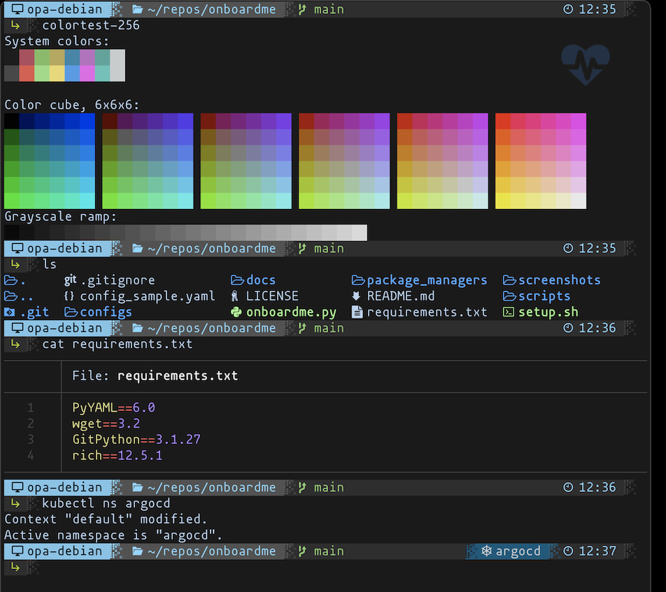

This is a project to store config files, as well as programatically install core packages across several package managers that I need for development. A lot of this was amassed from many years of quickly looking into a thing™️ , jotting it down, and then just hoping I'd remember why it was there later, so this is now a renewed effort in remembering all the thing™️s, and automating as much as possible. The idea is that it's faster, smaller, and easier to configure than it's ansible equivalent. Here's an example of the terminal after the script has run:

Looking for a project to get a fresh OS entirely, on a machine that has no OS? Check out [pxeless](https://github.com/cloudymax/pxeless).

Actually looking for a project to get started with self hosting k8s stuff? Check out [smol k8s homelab](https://github.com/jessebot/smol_k8s_homelab).

## Quick Start
[Get Started here :blue_heart:!](https://jessebot.github.io/onboardme/onboardme/quickstart)

#### Docs
You can find the bulk of my notes under the `docs/` directory in this repo, but I've also recently setup a justthedocs page [here](https://jessebot.github.io/onboardme/).

### Special Thanks
Thank you to @cloudymax for all their direct contributions for gaming on Linux, virtualization, rc file edits, and the hyper terminal configs. Also great engineer to rubberduck with generally. Couldn't have polished a lot of this without their patience during my late night ramblings about my 8 different package managers and why utf-8 isn't called utf-14 :3 :blue_heart:

### Status
Currently in late beta :3 Tested on macOS Monterey 12.5-12.6, and Debian 11 (Bullseye) and related Ubuntu downstream. Please report 🐛 in the GitHub issues, and I will get them as I have time. You can also open a pull request, and I can review it :blue_heart:
