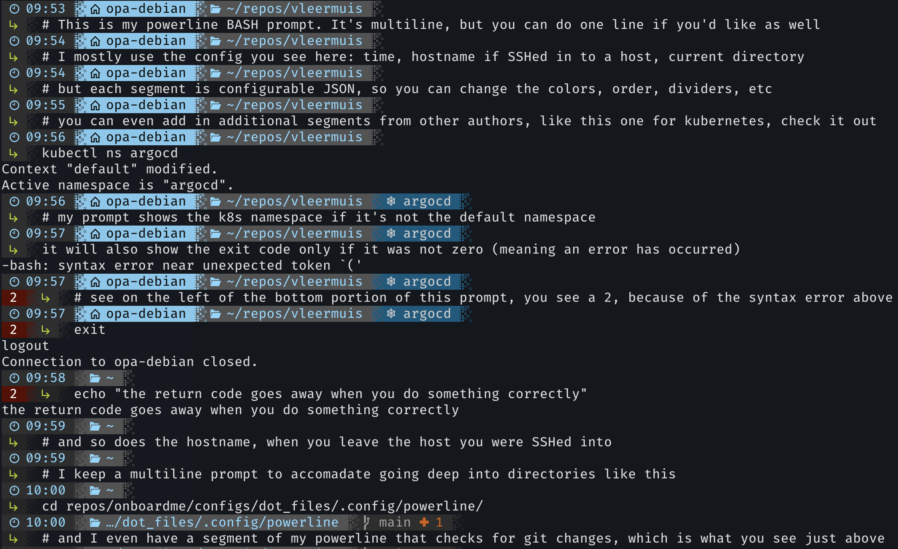
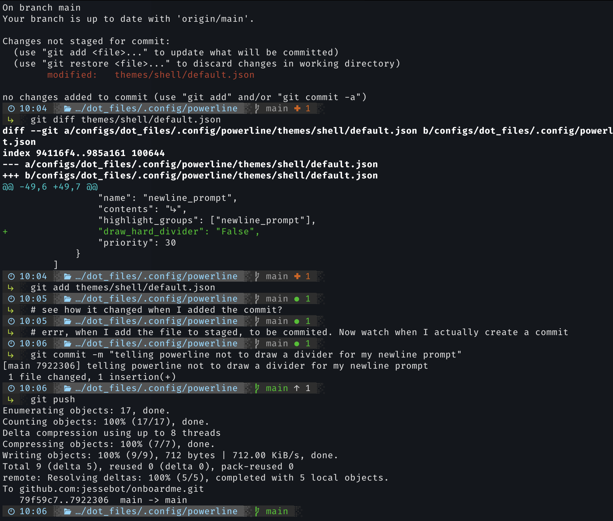

# Powerline - a status line for your terminal
[Powerline](https://github.com/powerline/powerline/tree/master) has plugins common shells, to create beautiful prompts for shells such as BASH or ZSH, but it can also work with vim, tmux, and other apps. You can check out the docs [here](https://powerline.readthedocs.io/en/master/index.html).

Here's an example of [my personal powerline setup](https://github.com/jessebot/onboardme/tree/main/configs/dot_files/.config/powerline):



Above you can see I use a multiline prompt in order to have space for a full command line interface, as well as useful data in the prompt, like current working directory. The line grows and shrinks depending on external factors like if I'm connected to a k8s cluster and I'm in a special namespace, or if the last command I ran failed. It's also useful for git status. I utilize this to cut down on typing things like `pwd`, `hostname`, `git status`, `echo $?`, and `date` constantly, because my RSI is terrible.



# Get Started
*Quick note, that at the base directory of this repo, there is a script called onboardme.py that will do all of this for you, but it's still useful to know what it's doing :) Onto the tutorial!*

Before you do anything, you should [install a nerdfont](https://github.com/ryanoasis/nerd-fonts#font-installation), if you haven't already. This will really help you to customize the icons. It's easiest for macOS with:
```bash
brew tap homebrew/cask-fonts
brew install --cask font-hack-nerd-font
```

Then install a modern version of python (like python3.10 at the time of writing this) using brew:
```bash
brew install python3.10
```

Finally, let's install powerline as well as an additional project called powerline-gitstatus:
```bash
pip3.10 install powerline-status
pip3.10 install powerline-gitstatus
```

## Configuration
Some notes on getting started with powerline as your BASH prompt.

### `.bashrc` updates
You'll need to update your `.bashrc` or `.bash_profile` with the location of your powerline script. Here's an example for python3.10 for Debian and also MacOS, assuming you used brew to install python3.10:
```bash
if [[ $(uname) == *"Linux"* ]]; then
    pip_packages="/home/linuxbrew/.linuxbrew/lib/python3.10/site-packages"
else
    # for macOS which stores pip packages in a different location
    pip_packages="/usr/local/lib/python3.10/site-packages"
fi

if [ -f $pip_packages/powerline/bindings/bash/powerline.sh ]; then
    powerline-daemon -q
    POWERLINE_BASH_CONTINUATION=1
    POWERLINE_BASH_SELECT=1
    . $pip_packages/powerline/bindings/bash/powerline.sh
fi
```

### Config files
The main locations you'll probably do configuration are themes and colorschemes. With themes, you can customize the segments of a powerline, and with colorschemes, you can customize the colors that those segments use. Any configs you mess with will likely be stored in your python packages location, so in linux, using homebrew to install python, I typically see the `config_files` in:
```bash
ls /home/linuxbrew/.linuxbrew/lib/python3.10/site-packages/powerline/config_files/
```

Which should show you the following directories and files:
```bash
colors.json  colorschemes  config.json themes
```

If you edit anything, make sure you copy it into your local config location, which powerline will read from first, which is always:
```bash
# you have to create this directory, as it does not exist by default!
~/.config/powerline
```

⚠️ *If you edit anything: You may need to restart powerline to see the changes take effect.* To restart powerline, just kill the process:
```bash
ps aux | grep powerline | awk '{print $2}' | xargs kill
```
Then just hit `ctrl`+`c` and you should be back on your merry way.

Not sure where to start? Try [my config](https://github.com/jessebot/onboardme/tree/main/configs/dot_files/.config/powerline) for inspiration :3

Good luck out there, friend!
